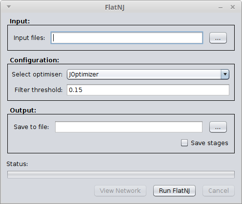
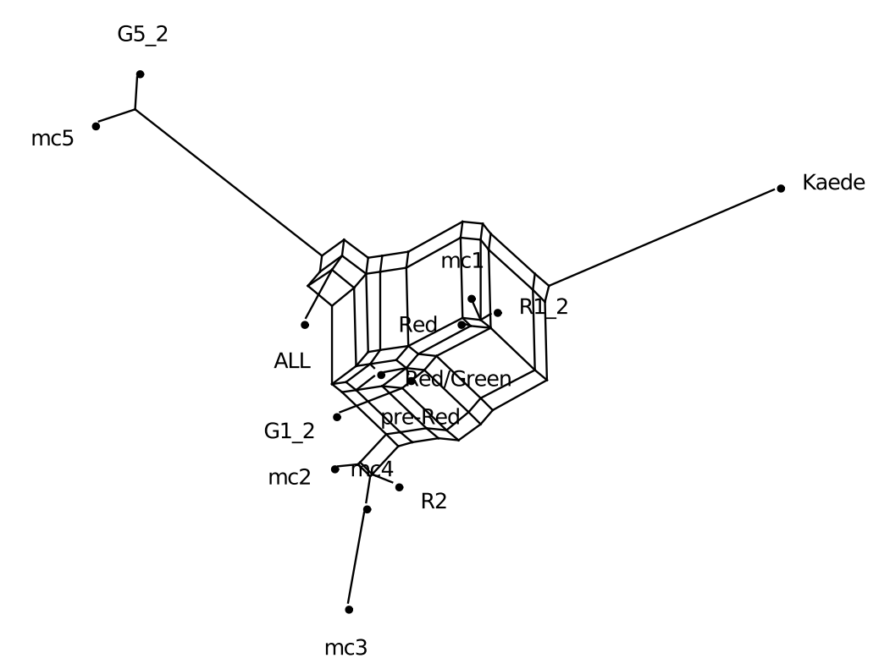
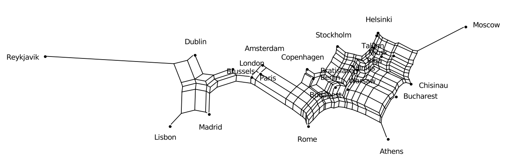

.. _flatnj:

Flat Neighbor Joining (FlatNJ)
==============================

The Flat Net Joining (FlatNJ) method for constructing split networks is presented in (Balvociute et al. 2013).
FlatNJ first generates a system of 4-splits (quadruples) from one of the following types of data:

1. multiple sequence alignment
2. geographical coordinates
3. weighted split system

In a system of 4-splits on a set `X` with `|X| >= 4`, for each 4-element subset fa; b; c; dg of X, all seven possible 4-splits
`a|bcd, b|acd, c|abd, d|abc, ab|cd, ac|bd and ad|bc` are assigned a non-negative weight.
FlatNJ then, from a given system of 4-splits, generates a split network that is guaranteed to be (almost) planar. FlatNJ
is based on an agglomerative approach similar to the one used in methods such as NeighborJoining (Saitou and Nei, 1987)
and NeighborNet (Bryant and Moulton, 2004).

The run time for generating the unweighted split system underlying the final result is O(n^4). Suitable Weights
for the splits are estimated using a least squares fitting between the given system of 4-splits and the system of 4-splits
induced by the resulting weighted split system. To solve the least squares problem the SPECTRE metaopt system is used to
hook into external solver, although we recommend that Gurobi Optimizer (www.gurobi.com) is used used as the external solver if available.
The resulting weighted splits are filtered using the approach described in (Grunewald et al. 2007) and, using
the method described in (Spillner et al. 2011), an almost planar split network is constructed. In order to view the
drawing of the network use a split network viewer, e.g. SplitsTree (Huson and Bryant, 2006).

When running FlatNJ for large datasets, it is recommended to allocate more RAM for the heap space. Otherwise an
OutOfMemoryError may occur. Heap space can be increased using the Java VM options ``-Xms`` or ``-Xmx``. See :ref:`running` for
more information on how to adjust these options with spectre scripts.

The split network is constructed from a system of 4-splits. The input system of 4-splits must be provided using
the positional argument ``<input>`` and the output is written to the file indicated by the ``-o/--out <nexus file>``
command line parameter.

Relatively small splits that are incompatible with much bigger splits are filtered out from the network using the approach
described in (Grunewald et al. 2007). The filtering threshold is a number between 0 and 1. The default filtering threshold
is 0.15. It can be altered using the ``-t/--threshold <[0.0,1.0]>`` parameter; choosing 0.0 as the threshold results in
an unfiltered network whereas 1.0 yields a network that is a tree.

Usage examples:

* To compute a split network from a system of 4-splits using the default threshold for filtering splits: ``flatnj -o network.nex system_of_4s.nex``
* To compute a split network from a system of 4-splits using a filtering threshold of 0.2: ``flatnj -thr 0.2 -o network.nex system_of_4s.nex``

Alternatively, FlatNJ can be invoked through the Tools menu of the SPECTRE viewer.

Walk through usage examples
---------------------------

The following walk through examples illustrate the usage of FlatNJ for molecular sequence data and for geographical data.
Note that the drawing of the network can be adjusted by the user in SplitsTree.

Molecular Sequence Data
~~~~~~~~~~~~~~~~~~~~~~~

To illustrate FlatNJ's usage for sequence data, we use sequences of fluorescent proteins (``<spectre_dir>/examples/flatnj/colors_aln.faa`` file in the
examples directory). For more information on this data set see the results section in (Balvociute et al. 2013). The
following steps will guide you through the whole process of the network construction for the fluorescent protein data set:

1. Open a terminal window and change to the directory of FlatNJ.

2. To compute a split network from the protein sequences fasta file type: ``flatnj -o <output_dir>/colors.nex <spectre_dir>/examples/flatnj/colors_aln.faa``

3. To view the network launch ``netview`` and open ``<output_dir>/colors.nex``. The network displayed by the viewer should look very similar to the one in Figure 1.

Figure 1: Split network generated from the multiple protein sequence alignment from ``<spectre_dir>/examples/flatnj/colors_aln.faa``.
Network displayed with SplitsTree.

Geographical data
~~~~~~~~~~~~~~~~~

To illustrate FlatNJ's usage for geographical data, we use coordinates of some of the European capitals (``<spectre_dir>/examples/flatnj/europe.nex``).
The following steps will guide you through the whole process of the network construction for the European capitals data set:

1. Open a terminal window and change to an empty working directory.
2. To compute a split network from the geographical data type: ``flatnj -o <output_dir>/europe_net.nex <spectre_dir>/examples/flatnj/europe.nex``
3. To view the network launch ``netview`` and open europe ``<output_dir>/europe_net.nex``. The network displayed by SplitsTree should look very similar to the one in Figure 2.

Figure 2: Split network generated from geographical coordinate data in examples/europe.nex data. Network
displayed with SplitsTree. The network was flipped and rotated approximately 90 degrees to the left to align it
with the usual representation on a map.

File formats
------------

For input and output files the nexus format is used, with the exception of multiple sequence alignments that may
also be provided as a fasta file. The various types of blocks in a nexus file used by this software package are listed
in Table 1. The syntax of blocks specific to this software package is defined below. The syntax of commonly used
blocks can be found e.g. in the SplitsTree manual (http://www.splitstree.org/).

Nexus block contents
~~~~~~~~~~~~~~~~~~~~

Commonly used blocks:

* CHARACTERS multiple sequence alignment
* DATA multiple sequence alignment
* DISTANCES character distance matrix
* SPLITS split system
* NETWORK split network

Specific blocks:

* LOCATIONS geographic coordinates
* QUADRUPLES system of 4-splits

Multiple sequence alignments may be provided in either fasta or nexus files. In case the nexus format is used,
sequences must be placed within the CHARACTERS or DATA blocks.

Geographical data can be processed in the form of coordinates of points in the plane using the LOCATIONS block.
The syntax for this block is as follows::

  BEGIN LOCATIONS;
    [DIMENSIONS NTAX=number-of-taxa;]
    [FORMAT LABELS={yes|left|no};]
  MATRIX
    [label_1] x_1 y_1,
    [label_2] x_2 y_2,
    ...
    [label_ntax] x_ntax y_ntax,
    ;
  END;

Distance matrices
~~~~~~~~~~~~~~~~~

Character distance matrices that are used by FlatNJ for the estimation of 4-split weights from multiple sequence
alignments must be placed in the DISTANCES block.

Systems of 4-splits
~~~~~~~~~~~~~~~~~~~

Systems of 4-splits are stored in the block QUADRUPLES. Each quadruple contains weights of all possible 4-splits over
a set of 4 taxa. The syntax of the block is as follows::

  BEGIN QUADRUPLES
    DIMENSIONS NTAX=number-of-taxa NQUADRUPLES=number-of-quadruples;
    [FORMAT [LABELS={LEFT|NO}] [WEIGHTS={YES|NO}];]
    MATRIX
      [label_1] : a1 b1 c1 d1 : [weight_a1|b1c1d1 weight_b1|a1c1d1 weight_c1|a1b1d1
                  weight_c1|a1b1c1 weight_a1b1|c1d1 weight_a1c1|b1d1 weight_a1d1|b1c1],
      [label_2] : a2 b2 c2 d2 : [weight_a2|b2c2d2 weight_b2|a2c2d2 weight_c2|a2b2d2
                  weight_c2|a2b2c2 weight_a2b2|c2d2 weight_a2c2|b2d2 weight_a2d2|b2c2],
      ...
      [label_n] : an bn cn dn : [weight_an|bncndn weight_bn|ancndn weight_cn|anbndn
                  weight_cn|anbncn weight_anbn|cndn weight_ancn|bndn weight_andn|bncn],
      ;
   END;

All weights must be written in the same line.

References
----------

* M.Balvociute, A.Spillner and V.Moulton. FlatNJ: A novel network-based approach to visualize evolutionary and biogeographical relationships, 2013. Systematic Biology, 2014.

* D.Bryant and V.Moulton. Neighbor-net: an agglomerative method for the construction of phylogenetic networks. Mol. Biol. Evol., 21:255–265, 2004.

* S.Grunewald, K.Forslund, A.Dress and V.Moulton. Qnet: An agglomerative method for the construction of phylogenetic networks from weighted quartets. Mol. Biol. Evol., 24(2):532–538, 2007.

* D.H.Huson and D.Bryant. Application of phylogenetic networks in evolutionary studies. Mol. Biol. Evol., 23(2):254–267, 2006.

* N.Saitou and M.Nei. The neighbor-joining method: a new method for reconstructing phylogenetic trees. Mol. Biol. Evol., 4:406–425, 1987.

* A.Spillner, B.Nguyen, and V.Moulton. Constructing and drawing regular planar split networks. IEEE/ACM Trans. Comput. Biol. Bioinform., 9:395–407, 2011.
