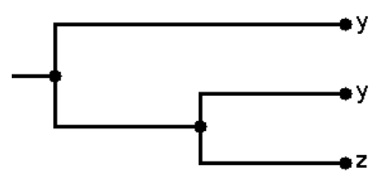
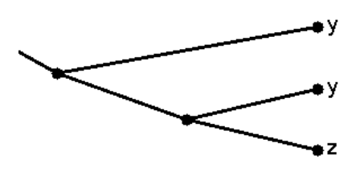
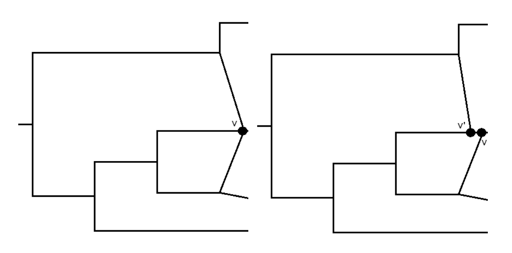

.. _padre_tools:

PADRE - Package for Analyzing and Displaying Reticulate Evolution
=================================================================

PADRE is a Java software package allowing the computation
and graphical representation of reticulate networks from input multi-labeled
(MUL) trees. The main functionality of the program is two-fold. Firstly,
it performs the consensus of a collection of multi-labeled trees M. Lott et
al (2008). Secondly, from a multi-labeled tree a phylogenetic network can
be constructed using the network construction approach in K. T. Huber et
al (2006). The options presented to the user depend on whether a single
MUL-tree or collection of MUL-trees are loaded into the program. In the
case that a collection of MUL-trees is loaded then the user is first prompted
to perform a consensus before running the network construction algorithm.

Running the program using the GUI
---------------------------------

The main window displays either the input MUL-trees, consensus MUL-trees
or phylogenetic networks depending on the stage of the algorithm execution.
Furthermore, the network construction algorithm can be run in steps and
the results are displayed at each step. Note that some options need to be
selected in order to view the network at each step. Initially the MUL-tree
is scaled to the screen width and height, however the slider at the top right
allows a range of sizes to be selected.

**Flagging nodes and edges** Any tree node or edge may be *flagged* by
the user simply by clicking it once, a flagged node is different colored and this
option can be useful for highlighting part of the tree considered interesting
for biological reasons. By default, vertices are not painted however, selecting
Paint vertices under the Layout menu will draw them with a circle. The
algorithm also uses this flagging feature to show subtrees under consideration
for merging when the Ask before merging option is selected for the network
construction algorithm.

Note: Edges are colored in bright green by the software in the case that
two or more completely overlap i.e. a species is thought to have separated
into two subspecies which then recombined into a new species.

**Slanted and rectangular edges** Mathematicians and computer scientists
prefer to use slanted edges as depicted in Figure 7 below whereby a line is
drawn directly connecting a given pair of vertices. Biologists however, prefer
to use rectangular edges as in Figures 1 to 6 whereby the edge follows a right
angle which is first vertical and then horizontal. Given that this program is
intended primarily for use by Biologists, edges are drawn using rectangular
edges by default. The Layout menu contains the options to switch to entirely
slanted edges by selecting the Use rectangular edges option.

    Figure 6: A tree represented with rectangular edges

    Figure 7: The same tree presented in Figure 6 with slanted edges

**Scaling the tree or network** Although the network is scaled by default
to fit exactly onto the user screen, it may be the case that for larger networks
this is simply too small. For this reason, an option is provided to scale the
network both larger and smaller at any point before, during and after the
execution of our algorithm.

Scaling is achieved by using the slider at the top right of the program window.
By default, scaling takes place on the X axis only, however with the *maintain aspect-ratio*
option selected scaling will simultaneously take place
along both the X and Y axis. If the structure is too big to fit on the screen
appropriate horizontal and vertical sliders may be used to focus on part of
the tree or network.

Running the program using the CLI
---------------------------------

A command line version of our software is available that may be used to
process difficult datasets on a cluster, or as part of a pipeline. The software
takes as input any newick file which contains a collection of MUL-trees and
outputs a newick file with the resulting consensus MUL-tree(s). The output
file has -result appended to the name, for example dataset1-result.tre
After downloading the software from our website, simply type ``padre``.
A list of options will be presented for performing the method as follows:
* -i The name of the input NEWICK text file for the consensus method.
* -t Threshold on the number of trees each cluster must be exhibited by.
For example, -t 2 would require that each cluster is exhibited by at
least two input trees.
* -o Output type (Optional). By default one of the best trees is arbitrarily
selected for output. -o a outputs all possible consensus trees. -o b
outputs all best consensus trees i.e. those with minimal hybrid number.
-o s outputs the collection of (possibly unresolved) MUL-trees found.
* -a Additional options (Optional). -a a Considers all clusters removed
by the threshold.

Performing a consensus from a collection of MUL-trees
-----------------------------------------------------

Overview -

Running the network construction algorithm
------------------------------------------

**Overview** In contrast to the consensus method, the network construction
problem is more tractable and our algorithm is expected to use minimal
computing power hence it will display results within a few minutes for 100
or less taxa. A formal description of the algorithm is given in K. T. Huber et
al (2006). We now briefly describe the options for the network construction
method

**Ask before merging** There are a couple of simple options available for
concerning the way in which the algorithm is run. The first of these Ask
before merging allows the user to receive a prompt so he/she may choose
whether to accept that two maximal inextendible subtrees should be merged.
Once all maximal inextendible subtrees T2 : : : Tn equivalent to T1 have been
accepted or declined for the process of subdivision, identification and pruning
takes place.

This option allows the user to run the algorithm step by step,
when selected the algorithm pauses after T1 is merged with T2 : : : Tn until
the *resume* button is clicked.

Editing the results
-------------------

Resolving interaction vertices An interaction vertex (any vertex with
in-degree greater than two) can be resolved by flagging two or more of the
incoming edges, these can then be *pushed up* by selecting Push up edges
from interaction vertex. In order to perform this operation, at least three
edges which share the same head vertex need to be selected.

    Figure 10: (Left) Before resolving the edges incoming into a vertex v. (Right) After performing this operation, a new vertex v0 is created.

References
----------

* K.T. Huber and V. Moulton (2006). Phylogenetic networks from multi-labelled trees, Journal of Mathematical Biology 52(5), 2006, 613-632.

* K.T. Huber, B. Oxelman, M. Lott and V. Moulton (2006). Reconstructing the evolutionary history of polyploids from multi-labeled trees, Molecular Biology and Evolution, 23(9), 2006, 1784-1791.

* K.T. Huber, M. Lott, V. Moulton and A. Spillner (2008). The complexity of deriving multi-labeled trees from bipartitions, Journal of Computational Biology, 15(6), 2008, 639-651.

* M. Lott, A. Spillner, K. T. Huber, A. Petri, B. Oxelman and V. Moulton (2008). Inferring polyploid phylogenies from multiply-labeled gene trees, BMC Evolutionary Biology 2009, 9:216.
