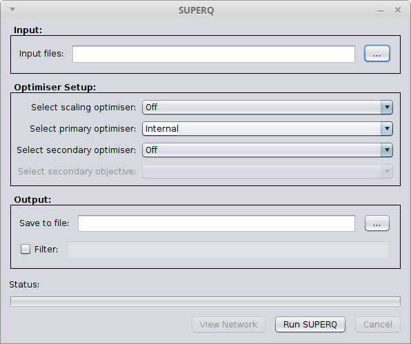

.. _superq:

SuperQ
======

SuperQ constructs a phylogenetic supernetwork from a set of weighted or unweighted partial trees by using quartets.
SuperQ can directly take system of quartets as input via nexus format or through a qweights format file (see :ref:`qweights` for more information).
Alternatively if quartets are not readily available, SuperQ can automatically construct them from one of the following formats:

* Nexus files with st splits (old format) or Splits blocks ([6], [5])
* Nexus files with distance blocks ([6], [5])
* Treebase syntax Nexus files with TREES blocks ([6])
* Newick trees, with or without branch lengths [8]

Example usage::

  superq -o <outfile> [-s <scaling_optimiser> -x <primary_optimiser>
         -y <secondary_optimiser> -b <objective> -f <filter_threshold>] <input_file> [<input_file>]...

Alternatively, SuperQ has a graphical interface that can be accessed via the Tools menu in the Spectre viewer:

When running SuperQ for large datasets, it is recommended to allocate more RAM for the heap space. Otherwise an
OutOfMemoryError may occur. Heap space can be increased using the Java VM options ``-Xms`` or ``-Xmx``. See :ref:`running` for
more information on how to adjust these options.

The supernetwork constructed from SuperQ can be visualised in the :ref:`viewer`.

.. _qweights:

QWeights example file
---------------------

The following is an example QWeights file::

  taxanumber: 6;
  description: artificial data;
  sense: max;
  taxon: 001 name: a;
  taxon: 002 name: b;
  taxon: 003 name: c;
  taxon: 004 name: d;
  taxon: 005 name: e;
  taxon: 006 name: f;
  quartet: 001 002 003 004 weights: 200 0 200;
  quartet: 001 002 003 005 weights: 200 0 200;
  quartet: 001 002 003 006 weights: 200 0 200;
  quartet: 001 002 004 005 weights: 210 0 210;
  quartet: 001 002 004 006 weights: 210 0 210;
  quartet: 001 002 005 006 weights: 410 0 410;
  quartet: 001 003 004 005 weights: 10 0 10;
  quartet: 001 003 004 006 weights: 10 0 10;
  quartet: 001 003 005 006 weights: 210 0 210;
  quartet: 001 004 005 006 weights: 200 0 200;
  quartet: 002 003 004 005 weights: 10 0 10;
  quartet: 002 003 004 006 weights: 10 0 10;
  quartet: 002 003 005 006 weights: 210 0 210;
  quartet: 002 004 005 006 weights: 200 0 200;
  quartet: 003 004 005 006 weights: 200 0 200;

References
----------

* S. Grünewald, A. Spillner, S. Bastkowski, A. Boegershausen, V. Moulton. SuperQ: Computing Supernetworks from Quartets. IEEE/ACM Transactions on Computational Biology and Bioinformatics, 10(1): 151–160, 2013.

* S. Grünewald, K. Forslund, A. Dress, V. Moulton. QNet: An Agglomerative Method for the Construction of Phylogenetic Networks from Weighted Quartets, Molecular Biology and Evolution, 24(2): 532–538, 2006. 

Credits
-------

The original version QNet and the original set of quartet tools were developed by:

* Stephan Grunewald
* Kristoffer Forslund

The original version of SuperQ was developed by:

* Sarah Bastkowski

The tools have been reengineered, optimised and integrated into SPECTRE by:

* Daniel Mapleson

All the tools have been developed, since inception, under the supervision of:

* Andreas Spillner
* Vincent Moulton
