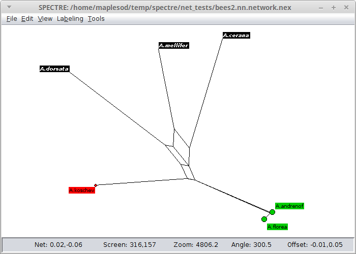

.. _spectre:

Spectre Viewer
==============

The Spectre Viewing tool allows users to visualise trees and networks stored in a nexus file.  An example screenshot of
a loaded networking is shown below.  The window is broken up from top to bottom into the menu bar, viewing canvas and status bar.

The viewer allows the user to navigate the network through pan, zoom and rotate controls.  Additionally, properties of nodes
can be altered, such as label positions, size and styles.

We will describe the functions the viewer offers by describing the menu bar items.

File menu
---------

*Open* - Opens a nexus file (Ctrl-O).  Files can also be opened dragging and dropping a suitable nexus file into window.
Additionally, spectre can automatically load a file at startup by passing the file an argument from the command line.
Suitable nexus files must either contain a "network" block describing the locations of nodes and edges of the network, or
they must contain a split system.  The viewer will automatically generate the nodes and edges from the split system to create
the network.

*Save* - Saves the current network (Ctrl-S), or saves the network to an alternative nexus file name via "Save as".  The saved
nexus file will contain the original split system, network nodes and edges and viewer configuration settings used at time
of save.  This allows the user to reload a network later without having to reapply all modifications.

*Save image* - Saves the image shown on the canvas.  Multiple images formats are supported:

 1. PDF - Contains vector graphics, suitable for publications.
 2. PNG - Rasterised image, lossless compression
 3. GIF - Rasterised image, lossless compression
 4. JPG - Rasterised image, lossy compression

When typing a file name please ensure that it has one of the extensions listed above in order to for netview to save to
the correct format.

Edit menu
---------

*Copy* - Copies the selected labels to the clipboard (Ctrl-C)

*Select all* - Selects all labels in the network (Ctrl-A)

*Find* - Selects labels the match a particular name or regular expression (Ctrl-F).  This option launches a separate dialog
window.

View menu
---------

Users can orientate the image via mouse and key controls and through items int the View menu.

*Pan* - Move the image around the screen (Arrow keys).  Can be controlled by holding the left-mouse button whilst moving
the mouse over the canvas where the initial click occurs away from labels.

*Rotate* - Rotate the image around the centre of the canvas (Ctrl-Left and Ctrl-Right).  Can be controlled through holding the right-mouse
button and moving the mouse relative to the centre point.

*Zoom* - Zoom the image in or out (Ctrl-Up and Ctrl-Down).  Can be controlled via the mouse scroll wheel.

*Flip* - The user can flip the image either horizontally (Shift-Ctrl-H) or vertically (Shift-Ctrl-V).

*Optimise layout* - This function rescale and translate the image so that the content fits the current canvas window best (Ctrl-P).

*Show trivial splits* - Toggles whether to show or remove splits that separate one taxon from the rest of the taxa in the network (Ctrl-T).

*Show range* - Toggles the ruler in the top left (Ctrl-R)

Labelling Options
-----------------

The viewer provides multiple options for controlling the look, feel and positioning of labelled nodes in the network.  These
options are controlled via the Labelling menu.

*Show labels* - Turns on or off whether node labels should be visible (Ctrl-L)

*Color labels* - Turns on or off whether the labels color should be inverted (i.e. Black text on white background, or white
text in a black box).  This option is only relevant if show labels is switched on.

*Format selected nodes* - Clicking on this option brings up a dialog box that allows users to modify the shape, size and color
of the currently selected nodes.  In addition, they can modify the size and style of the current selected nodes' label text.

*Fix all label positions* - This forces the labels to stay in the same proximity to the node as current viewed, even after
the image is rotated or flipped.

*Leaders* - Sometimes taxa labels would be placed so close to each other that the text would overlap on the screen.  This
often occurs with internal nodes.  To avoid this problem labels towards the edge of the window and joined to the network
node via a "leader" line in order to aid readability.  This sub-menu allows the user to control the look and feel of the leaders.

Tools
-----

The Spectre graphical interface can also launch other tools in the package.  These are launched via the Tools menu and will
create a separate window where the user can specify input and output files as well as parameters to be passed to the algorithms.
Details regarding the graphical interface for each tool are described along with the associated documentation.
